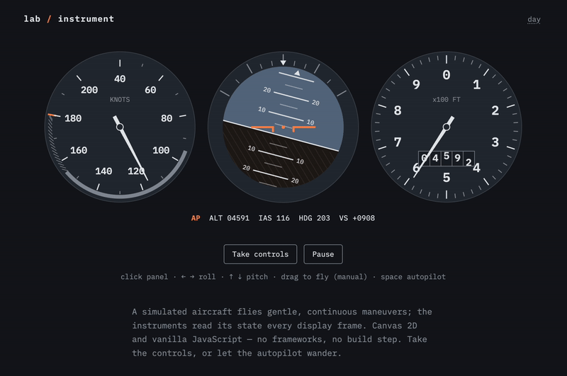

# lab / instrument

A working flight instrument panel drawn on Canvas 2D, driven by a simulated
flight — vanilla JS, no frameworks, no build step.

**Live demo:** <https://estebancitox.github.io/lab-instrument/>

<!-- demo.gif placeholder ------------------------------------------------
Record ~8 seconds of the autopilot demo (QuickTime screen recording or Kap),
convert to GIF (Kap exports directly; for QuickTime use e.g. gifski), save as
demo.gif in the repo root, then replace this comment with:

------------------------------------------------------------------------- -->

## How the sim works

A small flight model holds altitude, indicated airspeed, pitch, roll, heading,
and vertical speed. An autopilot director picks gentle maneuvers (climbing
turns, level-offs, descents) with randomized targets and durations; commanded
pitch and roll are tracked through a critically damped spring, so needles ease
— they never teleport. Heading follows the coordinated-turn formula
`(g / V) · tan(bank)`, vertical speed follows pitch and speed, and an envelope
guard keeps the flight inside 3,000–9,000 ft and 95–155 kt so the demo never
wanders off scale. Two incommensurate sine waves add a little atmosphere so
nothing is ever perfectly still.

## Controls

| Input | Action |
| --- | --- |
| Click / focus the panel | Enable the keyboard controls |
| `←` `→` | Roll (auto-centers on release) |
| `↑` `↓` | Pitch (holds on release) |
| `Space` | Toggle autopilot / manual |
| Drag on the panel | Virtual stick (manual mode, touch or mouse) |
| Buttons under the panel | Take controls · Pause |

Any flight input takes over from the autopilot; "Engage autopilot" hands it
back.

## Performance & accessibility

- Everything static (bezel, graduations, the entire horizon ball with its
  pitch ladder) is pre-rendered to offscreen bitmaps once per resize; the
  altimeter's rolling drum blits slices of a pre-rendered 0&ndash;9 digit
  strip. A frame is a few `drawImage` calls — no per-frame text
  rasterization.
- Backing stores use exact integer device pixels (device-pixel content box
  where available), so lines stay crisp at fractional devicePixelRatio.
- The loop pauses when the tab is hidden, when the panel is off-screen, and
  on demand; `prefers-reduced-motion` starts the page paused on a composed
  static frame with a visible "Resume motion" control, and flipping it on
  mid-session pauses too.
- Each canvas has an `aria-label`; a visually hidden status region announces
  mode changes and a summary every few seconds (the visible 10 Hz readout is
  deliberately not a live region).
- Self-hosted IBM Plex Mono, latin subset, two files, 11.7 KB total.
